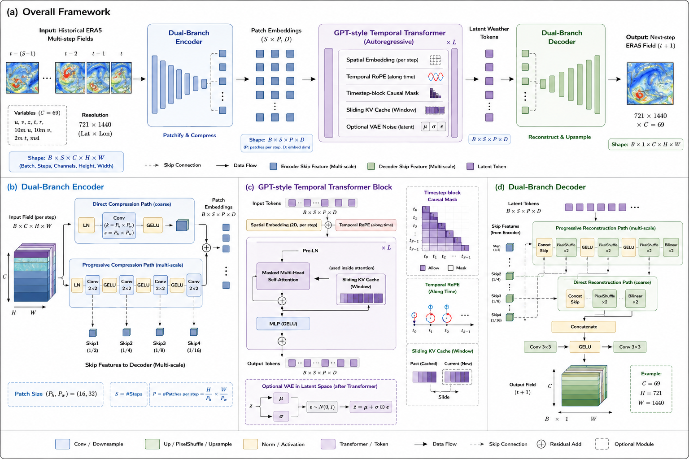

# Freewind

> **GPT-style decoder-only weather model on ERA5** — a research prototype for studying long-context, block-wise causal sequence modeling in data-driven NWP. Not a claimed SOTA system.

**Freewind** is an independent research prototype: an **Encoder → GPT Transformer (RoPE / block-wise causal / KV cache) → Decoder** pipeline for multi-timestep causal forecasting on ERA5. The focus is whether, at fixed parameter count, longer context can slow autoregressive error growth — not reproducing leaderboard scores from short-context ViT-style paradigms.

Author: Jinyu Guo (independent research). This repository provides a trainable model skeleton and data interface; it does **not** include multi-TB ERA5 raw data or pretrained weights.

---

## Motivation and paradigm

Existing data-driven global forecast systems (Pangu / Fuxi / FengWu / GraphCast, etc.) are already strong at short-to-medium range, but training and inference mostly center on **short context** (1→1 or 2→1) and **image/graph paradigms** (ViT, Cube Embedding, GNN). Multiple frames are often stacked into channels and mixed by spatial convolutions, which can weaken temporal order and trend direction; lengthening the input sequence usually requires changing the input layer, so **parameter count and sequence length are hard to decouple**.

Freewind’s working hypotheses are:

1. Tokenize weather fields into spatiotemporal tokens and use **block-wise (timestep-block) causal attention** (patches within the same timestep attend bidirectionally; future timesteps are masked) for next-step prediction, so sequence length can be adjusted without changing backbone width;
2. Longer explicit history may help constrain autoregressive evolution (whether this holds must be tested with controlled ablations);
3. Under fixed compute, one should systematically study the relationship among \(N\) (parameters), \(S\) (context), \(D\) (data), and effective forecast skill — rather than “filling one GPU.”

In that sense it is closer to an **LLM-style sequence modeling framework for LWM (Large Weather Model)** than “yet another stronger single-step Fuxi.”

---

## Architecture overview



```
ERA5 fields (B, S, C, H, W)
        │
        ▼
┌───────────────────┐
│  Encoder          │  PeriodicConv dual-branch CompressPatch
│  (local compress) │  → patch embedding + optional skip
└─────────┬─────────┘
          │  (B, S, P, E) → flatten (B, S·P, E)
          ▼
┌───────────────────┐
│  GPT Transformer  │  block-wise (timestep-block) causal mask · spatial Embedding
│                   │  temporal RoPE · KV cache · optional VAE noise
└─────────┬─────────┘
          │  reshape back to patch grid
          ▼
┌───────────────────┐
│  Decoder          │  expansion upsample (PixelShuffle / ConvTranspose)
│  (field rebuild)  │  + encoder skip → (B, S, C, H, W)
└───────────────────┘
```

| Module | File | Highlights |
|--------|------|------------|
| Encoder | `model_archi_encoder.py` | Meridional circular / zonal constant `PeriodicConv2d`; dual-branch compress then add; `PermuteLayerNorm2d` |
| GPT | `model_archi_GPT.py` | Block-wise causal mask by `patches_one_step` timestep blocks; learnable spatial PE; temporal RoPE; inference-side KV cache / sliding-window examples |
| Decoder | `model_archi_decoder.py` | Mirrored from Encoder `configure()`; default PixelShuffle + concat skip; final bilinear alignment |
| Full model | `model_archi_complete.py` | `ModelComplete`: Encoder → GPT → Decoder |
| Training wrapper | `model_main.py` | LightningModule; AdamW + WarmupCosine; default L1 (residual target) |

**Training objective:** the Dataset returns `target - input` residuals (causal alignment: shift input one frame and append the next-step ground truth). When interpreting RMSE, account for denormalization and how residuals are accumulated.

Default experiment scale (see `configs.py`): about **126M** parameters (`emb≈1024`, `layers=6`, `heads=8`, `patch=(8,16)`, `resample_scale=2`, `max_seq_len_per_forward=2`).

---

## Repository layout

```
WeatherModel_opensource/
├── imports.py                 # Dependencies and Lightning imports
├── configs.py                 # Model / data / training hyperparameters and paths
├── model_archi_encoder.py     # Encoder
├── model_archi_GPT.py         # GPT-style Transformer
├── model_archi_decoder.py     # Decoder
├── model_archi_complete.py    # Three-stage assembly + sliding-window inference example
├── model_main.py              # LightningModule (optimizer, L1/VAE loss)
├── dataset_define.py          # ERA5 Zarr Dataset (normalization, residual target)
├── dataset_main.py            # Lightning DataModule
├── normalization.py           # Offline mean/std → Zarr
├── trainer.py                 # DDP + 16-mixed training entrypoint
└── custom_callbacks.py        # Checkpoint loading helpers
```

---

## Environment and dependencies

Dependencies are inferred from what `imports.py` / `normalization.py` actually import; **this repo does not ship a pinned `requirements.txt`** (except a comment noting Lightning ≈ 2.1.3). Prepare an environment compatible with your cluster, for example:

| Package | Role |
|---------|------|
| `torch` | Model and training |
| `pytorch-lightning` | Training loop (comment: ~2.1.3); also uses `lightning.pytorch.profilers` |
| `einops` | Tensor rearrange |
| `xarray`, `zarr`, `dask` | ERA5 Zarr I/O |
| `numpy`, `pandas` | Time indexing and arrays |
| `tensorboard` | Logging / Profiler |

Install example (choose versions for your CUDA / cluster policy):

```bash
pip install torch pytorch-lightning einops xarray zarr dask numpy pandas tensorboard
```

Add this directory to `PYTHONPATH`, or run scripts from inside the directory.

---

## Data (bring your own)

This repository does **not** provide ERA5 raw data or a unified Zarr snapshot (size can reach tens of TB). Users must obtain data from [CDS](https://cds.climate.copernicus.eu/) or similar and organize it as **multi-group Zarr** compatible with `dataset_define.py`.

### Expected variables and channels

Aligned with common Fuxi / FengWu setups, **69** channels total:

- **Pressure levels (5×13):** `u` / `v` / `z` / `t` / `r` (relative humidity), 13 levels  
- **Surface (4):** `10m_u` / `10m_v` / `2m_t` / `msl`

Zarr group names must match the Dataset, for example:

| Logical variable | Zarr group |
|------------------|------------|
| u / v / z / t / r | `u_component_of_wind`, `v_component_of_wind`, `geopotential`, `temperature`, `relative_humidity` |
| Surface | `10m_u_component_of_wind`, `10m_v_component_of_wind`, `2m_temperature`, `mean_sea_level_pressure` |

Grid defaults to ERA5 global **721 × 1440**; training may nearest-neighbor downsample via `resample_scale`. Timestep sampling is **6-hourly**.

### Time splits (as in the code)

| Split | Approximate range |
|-------|-------------------|
| train | 1979–2009 (6h) + 2010–2015 |
| validation | 2016–2017 |
| testing | 2018–2020 |

Note: historical data resolution may be inconsistent around the 2009/2010 boundary; `init_time` must land on a strict 6h grid, or time-key misses may occur.

### Normalization

Run `normalization.py` (edit the Zarr path first) to compute global mean/std per variable / pressure level over the training period, writing to:

```text
<parent_of_era_zarr>/era5_norm_stats/norm_stats_<group>.zarr
```

`ERA_Dataset` loads from this convention automatically.

In `configs.py` set:

```python
dir_ERA = "/path/to/your_era5_unified.zarr"
parent_path = "/path/to/experiment_root/"   # root for checkpoints / TensorBoard
```

---

## How to run

### 1. Smoke test: Dataset / model forward

```bash
# Requires prepared Zarr and norm stats
python dataset_define.py

# Random-tensor forward (no real data; default shapes are in the script)
python model_main.py
# or
python model_archi_complete.py
```

### 2. Offline normalization

```bash
# Edit the fn path in normalization.py, then:
python normalization.py
```

### 3. Multi-GPU training (main entry)

Edit `configs.py` (sequence length, GPU list, `dir_ERA`, `parent_path`, `epoch`, etc.), then:

```bash
python trainer.py
```

`trainer.py` will:

- Build `Model_pl` + `ERA_Dataset_pl`
- Use **DDP**, `precision='16-mixed'` (when `dtype=float16`)
- Save `latest_*` per epoch / `best_*` by `valid_loss_epoch`
- Optionally enable PyTorch Profiler (`enable_profiler=True`)

The `fit_or_predict == 'predict'` branch is currently empty; `predict_step` is also unimplemented. Formal rollout / RMSE evaluation must be done in external scripts or notebooks. Paths, device lists, epochs, etc. are hardcoded in `configs.py` — after cloning, change them to local paths.

---

## Status and results (stated as-is)

This project is a **research prototype**, not a claimed long-range SOTA, and has not been formally compared with Pangu / Fuxi under the same public leaderboard protocol. Relative to industrial-scale models, training epochs / data throughput are clearly insufficient.

What exists:

- Trainable Encoder–GPT–Decoder skeleton (RoPE, block-wise causal mask, KV cache interface)
- ERA5 Zarr Dataset, residual L1, Lightning DDP + AMP + Checkpoint
- Cluster-scale runs at ~126M parameters; preliminary `max_seq_len=2` vs `6` comparison

Known limitations and negative results (summary):

| Issue | Notes |
|-------|-------|
| **Training and ablations** | Later crowded out by PhD mainline work, this project was not fully trained; in existing experiments, at fixed parameter count, `maxstep=6` vs `maxstep=2` showed **no stable advantage**. |
| **Block artifacts** | Non-overlapping convolutional compression produces visible block artifacts on long rollouts |

---

## Citation and license

Independent research author: **Jinyu Guo**. No formal paper DOI yet; if you cite this code, please name the repository and author, and note that it is a research prototype.

License suggestion: add an **MIT** or **Apache-2.0** `LICENSE` file at the repo root and use under that license. If this directory does not yet contain a LICENSE, follow any later statement by the author; confirm license text is in place before contributing or redistributing.

---

## Disclaimer

This software is a **research prototype** only, for method exploration and controlled experiments. It must **not** be used as operational numerical weather prediction (NWP) or decision-support; no warranty is given for forecast accuracy, lead time, or any derived consequences. Copyright and terms for ERA5 and related data belong to the data providers; users must obtain and cite them in compliance with those terms.
